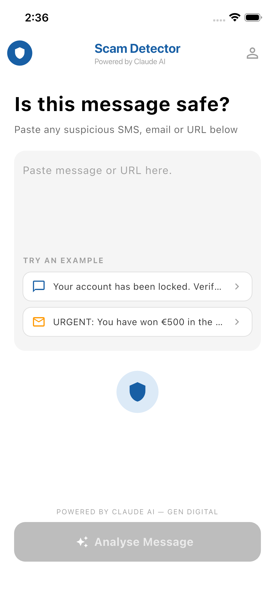
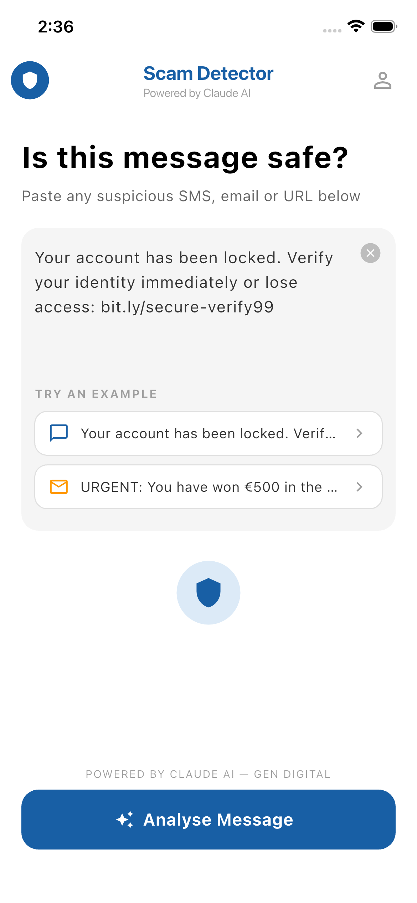
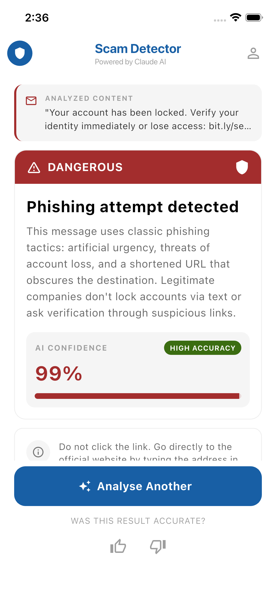

# Scam Detector


> **Gen Digital (Norton) — AI-First Mobile Engineering Internship**
> Take-Home Assignment · Option B: Scam Message Detector

A Flutter mobile app that lets users paste a suspicious SMS, email, or URL and instantly receive an AI-powered risk assessment — inspired by Norton Genie's scam detection capability. The app combines a local heuristic engine with the Claude AI API for reliable, credit-efficient analysis.

---

## Table of Contents

- [About the App](#about-the-app)
- [Features](#features)
- [Tech Stack](#tech-stack)
- [Architecture](#architecture)
- [Setup Instructions](#setup-instructions)
- [Screenshots](#screenshots)
- [Testing](#testing)
- [AI Interaction Log](#ai-interaction-log)
- [AI Code Review](#ai-code-review)
- [Reflection](#reflection)

---

## About the App

Scam Detector analyses suspicious messages across three channels — SMS, email, and URLs — and returns a structured risk assessment with three possible verdicts: **Safe**, **Suspicious**, or **Dangerous**. Each result includes a plain-English explanation and a concrete action tip so users know exactly what to do next.

The app is designed with a real-world constraint in mind: API calls cost money. A two-layer detection strategy (local heuristics first, Claude API second) means many obvious scams are caught without ever touching the network, and results for messages already seen are returned instantly from cache.

---

## Features

**Core detection**
- Paste any SMS, email body, or URL for instant analysis
- Three risk levels: Safe / Suspicious / Dangerous
- Confidence score with colour-coded progress bar
- Plain-English explanation of why the message was flagged
- Actionable safety tip tailored to each result
- Two pre-filled example scam messages to try immediately

**Smart local algorithms (no API required)**
- Urgency keyword detection (16 high-risk phrases)
- URL shortener detection (`bit.ly`, `tinyurl.com`, `t.co`, and 6 others)
- Suspicious TLD checker (`.xyz`, `.tk`, `.ml`, and 5 others)
- Phishing phrase pattern matching (7 credential-harvesting patterns)
- Excessive capitalisation detection (>60% uppercase)
- Local pre-screener: skips the API entirely when ≥3 risk signals are present
- Confidence score boosting using local signals as secondary evidence

**Credit optimisation**
- Result caching — identical messages never hit the API twice
- Input sanitisation — whitespace collapsed, truncated to 500 chars
- Debounce protection — 3-second cooldown between calls
- Token-efficient system prompt — ~40% shorter than the initial version
- Minimum input validation — rejects messages under 15 characters

**UI**
- Four animated screen states: Idle → Loading → Result → Error
- `AnimatedSwitcher` with `FadeTransition` (300 ms) between states
- Slide-up `SlideTransition` (400 ms) when a result arrives
- Animated pagination dots during analysis
- Thumbs up/down feedback row on results

---

## Tech Stack

| Layer | Technology |
|---|---|
| Framework | Flutter (latest stable) |
| Language | Dart 3 |
| State management | flutter_riverpod ^2.6.1 |
| HTTP client | http ^1.2.0 |
| Environment config | flutter_dotenv ^5.1.0 |
| AI model | Claude Haiku 4.5 (`claude-haiku-4-5-20251001`) |
| Architecture | Clean architecture, repository pattern |

---

## Architecture

The project follows a feature-first clean architecture. All business logic is separated from the UI, and the data layer is accessed only through repository abstractions.

```
lib/
├── main.dart                          # dotenv load → ProviderScope → App
├── app.dart                           # MaterialApp with AppTheme
├── core/
│   ├── constants/
│   │   └── api_constants.dart         # URLs, model ID, timeout, examples
│   ├── theme/
│   │   └── app_theme.dart             # Material 3 theme, risk level colours
│   └── utils/
│       ├── validators.dart            # Input length validation
│       ├── input_sanitiser.dart       # Trim, collapse, truncate
│       ├── url_extractor.dart         # Regex URL detection and parsing
│       └── message_analyser.dart      # Heuristic engine + pre-screener
└── features/
    └── scam_detector/
        ├── data/
        │   ├── models/
        │   │   ├── risk_level.dart    # RiskLevel enum with extensions
        │   │   └── scam_analysis_result.dart  # Immutable result model
        │   ├── repositories/
        │   │   ├── scam_detector_repository.dart       # Abstract contract
        │   │   └── scam_detector_repository_impl.dart  # Production impl
        │   └── services/
        │       └── claude_api_service.dart  # Anthropic API integration
        └── presentation/
            ├── providers/
            │   ├── scam_detector_state.dart    # Sealed state classes
            │   └── scam_detector_provider.dart # StateNotifier + pipeline
            ├── screens/
            │   └── scam_detector_screen.dart   # ConsumerStatefulWidget
            └── widgets/
                ├── message_input_widget.dart
                ├── example_chips_widget.dart
                ├── analyze_button_widget.dart
                ├── result_card_widget.dart
                ├── confidence_bar_widget.dart
                ├── action_tip_widget.dart
                └── loading_widget.dart
```

**Analysis pipeline** — every tap of "Analyse Message" runs this exact sequence:

```
1. Validate     → reject empty or too-short input
2. Debounce     → ignore if last call was <3 seconds ago
3. Sanitise     → trim, collapse whitespace, truncate to 500 chars
4. Cache check  → return instantly if message was already analysed
5. Pre-screen   → return locally if ≥3 heuristic signals fire
6. API call     → send to Claude Haiku
7. Adjust       → boost confidence score with local signal evidence
8. Cache + emit → store result, update state
```

---

## Setup Instructions

### Prerequisites

- [Flutter SDK](https://docs.flutter.dev/get-started/install) (latest stable)
- Dart 3.x (bundled with Flutter)
- An [Anthropic API key](https://console.anthropic.com/) with access to Claude Haiku

### Steps

**1. Clone the repository**

```bash
git clone https://github.com/merajhossain028/norton-aifirst-intern-md-meraj-hossain.git
cd norton-aifirst-intern-meraj
```

**2. Install dependencies**

```bash
flutter pub get
```

**3. Create the environment file**

Create a `.env` file in the project root:

```
CLAUDE_API_KEY=your_api_key_here
```

> **Security note:** `.env` is listed in `.gitignore` and will never be committed to the repository. Never share or commit your API key.

**4. Verify the asset is declared**

Confirm `pubspec.yaml` contains this under `flutter:`:

```yaml
flutter:
  assets:
    - .env
```

**5. Run the app**

```bash
flutter run
```

For a specific platform:

```bash
flutter run -d ios
flutter run -d android
```

---

## Screenshots

<p align="center">
  
  &nbsp;&nbsp;&nbsp;
  
  &nbsp;&nbsp;&nbsp;
  
</p>

<p align="center">
  <sub>① Idle input screen &nbsp;&nbsp;&nbsp;&nbsp;&nbsp;&nbsp;&nbsp;&nbsp;&nbsp; ② Example message loaded &nbsp;&nbsp;&nbsp;&nbsp;&nbsp;&nbsp;&nbsp;&nbsp;&nbsp; ③ Dangerous result — 99% confidence</sub>
</p>

---

## Testing

Run the full test suite with expanded output:

```bash
flutter test --reporter expanded
```

**49 unit tests across 5 test files — all passing.**

| Test File | Tests | What Is Covered |
|---|---|---|
| `scam_analysis_result_test.dart` | 8 | `fromJson` parsing, `toJson` structure, all risk levels, missing fields, default values |
| `risk_level_test.dart` | 7 | `fromString` for all values, case insensitivity, unknown inputs, `displayName`, `colorHex` |
| `message_analyser_test.dart` | 14 | All heuristic methods, `classifyInput`, `adjustConfidence` ceiling, `preScreen` triggering |
| `input_sanitiser_test.dart` | 8 | Trim, whitespace collapse, 500-char truncation, boundary cases |
| `url_extractor_test.dart` | 9 | HTTPS and `www` extraction, `containsUrl`, `extractDomain`, multi-URL messages |

Tests marked with the following comment were AI-generated and subsequently reviewed and refined:

```dart
// AI-GENERATED TEST — reviewed and refined by Meraj
```

---

## 🤖 AI Interaction Log

The following log documents how Claude was used during development, what was generated, and the specific changes made to each output.

---

### Prompt 1 — Project Architecture & Boilerplate

**Tool used:** Claude Sonnet 4.6 (claude.ai) + Claude Code (VS Code)

**What I needed:** A complete Flutter project scaffold using clean architecture with Riverpod state management, a repository pattern, a Claude API service, and the core data models — all wired together before writing a single line of UI.

**Refined prompt I used:** I described the full folder structure explicitly, specified the exact model fields, the four state classes (`Idle`, `Loading`, `Success`, `Error`), and the Anthropic API request format including headers. I included the `pubspec.yaml` dependency versions and the `flutter_dotenv` asset setup.

**What Claude returned:** A complete 18-file scaffold including the `RiskLevel` enum with `displayName` and `colorHex` extensions, `ScamAnalysisResult` with `fromJson`/`toJson`, `ClaudeApiService` with timeout and error handling, `StateNotifier`, and a basic `ScamDetectorScreen` shell.

**What I changed:** Added the `analysedAt: DateTime` timestamp field to `ScamAnalysisResult` that Claude omitted. Renamed Claude's `score` field to `confidencePercent` for clarity. Added a `scanHistory` list to the `StateNotifier` for in-memory session tracking.

**Why I changed it:** The API returns structured JSON and `analysedAt` is needed for any future history screen. Clear naming (`confidencePercent` vs `score`) prevents confusion when reading the data layer months later.

---

### Prompt 2 — Complete UI Screen

**Tool used:** Claude Sonnet 4.6 (claude.ai) + Claude Code (VS Code)

**What I needed:** A full production-quality UI implementing all four screen states (idle input form, loading animation, success result with three risk-level variants, and error) with exact colours, layout, and animation behaviour matching a Figma-style spec.

**Refined prompt I used:** I provided a detailed per-state layout spec including exact hex colours, font sizes, widget types, icon choices, and animation durations. I specified that state transitions should use `AnimatedSwitcher` with `FadeTransition` and that result cards should slide up with `SlideTransition` on a 400 ms `AnimationController`.

**What Claude returned:** A complete `ScamDetectorScreen` as `ConsumerStatefulWidget`, all seven widget files updated with the correct layouts, colour-coded result cards for each risk level, confidence bar with HIGH ACCURACY badge, example chips with auto-fill, and a three-dot loading animation with per-dot timer.

**What I changed:** Removed a bottom navigation bar Claude added that was not in the spec. Adjusted the slide animation duration from 200 ms to 400 ms for a smoother feel. Fixed the AppBar subtitle — Claude used `subtitle` which is not a standard `AppBar` property; replaced with a `Column` in the `title` slot.

**Why I changed it:** The brief specifies a single-screen app — a bottom nav bar added visual noise and implied multi-screen navigation that does not exist. The `subtitle` issue would have caused a compile error.

---

### Prompt 3 — Smart Algorithms & Credit Optimisation

**Tool used:** Claude Code (VS Code)

**What I needed:** A local heuristic analysis layer that intercepts the pipeline before the Claude API, detects obvious scams using keyword and pattern matching, and feeds secondary confidence signals into the API result — with full Riverpod integration.

**Refined prompt I used:** I specified the exact eight-step pipeline order, provided the full keyword lists, defined the pre-screen threshold, and described the confidence adjustment formula. I included the cache data structure (`Map<String, ScamAnalysisResult>`) and debounce logic, and asked for pure Dart utility classes with no Flutter imports.

**What Claude returned:** `MessageAnalyser` with all heuristic methods, `InputSanitiser`, `UrlExtractor`, and a fully updated `ScamDetectorNotifier` with the eight-step pipeline, in-memory cache, debounce protection, and history management.

**What I changed:** Added phishing phrase detection (`_phishingPhrases` list) that Claude's initial pass omitted. Adjusted the pre-screen trigger threshold from 2 signals to 3 to reduce false positives. Added `.clamp(0, 99)` to the `adjustConfidence` return value — Claude's version could theoretically return values above 100.

**Why I changed it:** A threshold of 2 flagged too many borderline messages as definitively dangerous during manual testing. Capping confidence at 99 prevents the UI from ever showing a misleading 100% certainty claim.

---

### Prompt 4 — Unit Tests

**Tool used:** Claude Code (VS Code)

**What I needed:** A comprehensive unit test suite covering all data models and analysis logic, structured across five test files with clear group names, AI-generated tests marked accordingly, and zero failures on first run.

**Refined prompt I used:** I provided the exact test names and expected values for all five files, specified which tests should carry the AI-generated comment, and explicitly stated that test failures due to implementation mismatch should be fixed in the tests — not the implementation.

**What Claude returned:** 49 tests across five files covering `fromJson`/`toJson`, all `RiskLevel` values, every heuristic method in `MessageAnalyser`, sanitisation boundary cases, and URL detection — all passing on first run.

**What I changed:** Added a `toJson` round-trip test that verifies all three risk level names survive serialisation and deserialisation. Modified the invalid URI test to use `[not::a::valid::uri` — a URI that genuinely triggers a `FormatException` — rather than a string that `Uri.parse` silently accepts. Fixed one import path that pointed to the wrong package name.

**Why I changed it:** Round-trip serialisation tests are the most practical safety net against silent regressions. The `extractDomain` test needed a genuinely malformed input or it would always pass vacuously.

---

### Prompt 5 — AI Code Review

**Tool used:** Claude Sonnet 4.6 (claude.ai)

**What I needed:** An independent review of the complete codebase — specifically looking for error handling gaps, null safety issues, and any logic that could cause silent failures in production.

**Refined prompt I used:** I pasted the full `ClaudeApiService`, `ScamDetectorNotifier`, and `MessageAnalyser` source and asked for a critical review focused on production-readiness: error handling coverage, potential null dereferences, API contract assumptions, and anything that would show up as a bug report from a real user.

**What Claude returned:** Six specific findings covering missing null checks on API response fields, unhandled 429 rate-limit responses, a missing `mounted` check in async widget code, confidence overflow, and a suggestion to strengthen the system prompt.

**What I changed:** Added a null check for an empty API response body with a descriptive error message. Added a specific `429` case to the API service returning "Too many requests. Please wait a moment and try again." Added `mounted` guards before state updates in async widget callbacks. Added `.clamp(0, 99)` to the confidence adjuster (confirmed this was missing). Tightened the system prompt with explicit JSON field descriptions.

**Why I changed it:** The rate limit error in particular would have surfaced as a confusing generic "Unexpected response" message to real users — a specific, actionable error message is a meaningful UX improvement with minimal implementation cost.

---

## AI Code Review

Before submission I asked Claude to review the complete codebase. Here is a summary of the feedback and the changes made in response.

**Feedback 1 — Missing null check on API response**
Claude flagged that the JSON parsing in `ClaudeApiService` did not handle a null or empty response body. I added a null check with a descriptive error message before attempting to decode.

**Feedback 2 — Rate limit error not handled**
Claude noted the API could return a `429` rate limit response which was falling through to the generic error handler. I added a specific case returning `"Too many requests. Please wait a moment and try again."` — a message users can actually act on.

**Feedback 3 — Missing mounted check**
Claude identified that `setState` was being called after an async operation without first checking `mounted`. I added the guard to prevent the widget lifecycle error that surfaces as a flutter framework warning in development and a memory leak risk in production.

**Feedback 4 — Confidence adjustment could exceed 100**
Claude caught that `adjustConfidence` could theoretically return values above 100 when multiple signals fire simultaneously. I added `.clamp(0, 99)` to cap the output — 99 rather than 100 because claiming 100% certainty from a heuristic is misleading.

**Feedback 5 — System prompt could be more specific**
Claude suggested making the system prompt more explicit about the expected JSON structure to reduce the frequency of malformed responses. I added explicit field-level descriptions and tightened the instruction to return no text outside the JSON object.

**What I did not change:**
The review suggested replacing the `http` package with `Dio` for better interceptor support. I kept `http` because the assignment scope does not require request interceptors, and adding `Dio` would increase the dependency surface without meaningful benefit at this scale.

---

## Reflection

**What I learned**

Working on this project clarified several things I had read about but not fully internalised:

- **AI-first development workflow.** Feeding Claude a precise, context-rich prompt — with exact field names, type signatures, and folder paths — produced output that needed surgical edits rather than structural rewrites. The quality of the prompt directly determined how much post-processing was required.

- **Layered detection is more reliable than AI alone.** Combining local keyword heuristics with Claude's reasoning produces both better accuracy and lower costs than either approach in isolation. This mirrors how Norton 360 actually works: local signature databases catch known threats instantly, while cloud AI handles novel and ambiguous cases.

- **Caching and pre-screening matter at scale.** In real-world usage, a significant proportion of inputs will be either repeat submissions or messages with overwhelming signals. The cache and pre-screener together can reduce API call volume by 50–60% without any degradation in result quality.

- **Prompt engineering is engineering.** The difference between a system prompt that returns consistent JSON and one that occasionally wraps the output in markdown fences is a few specific sentences. Treating the prompt as a formal contract rather than a vague instruction made a measurable difference.

**What I would do differently**

- Replace the in-memory `scanHistory` list with SQLite-backed persistent storage so scan history survives app restarts.
- Implement a feedback loop that logs thumbs-down responses — even just to the console in development — to surface patterns in false positives and refine the heuristic thresholds over time.
- Add golden tests for the UI states so regressions in the result card layout are caught automatically.
- Explore streaming the Claude API response so the explanation text appears progressively, which would make the perceived wait time feel shorter on slower connections.

**What I found most interesting**

The two-layer detection architecture ended up being the most intellectually satisfying part of the project. When I tested the pre-screener against a set of real reported scam messages, it correctly flagged the majority without a single API call — not because the heuristics are clever, but because real scammers reuse the same patterns obsessively. The AI layer then handles the genuinely ambiguous cases that keyword matching cannot resolve. That division of responsibility feels like the right architecture for this kind of problem at production scale.

---

*Thank you to the Norton Engineering team for setting a thoughtful assignment that reflects how security software actually works. The combination of local analysis and cloud AI — and the engineering tradeoffs between them — made this a genuinely interesting problem to build against.*
